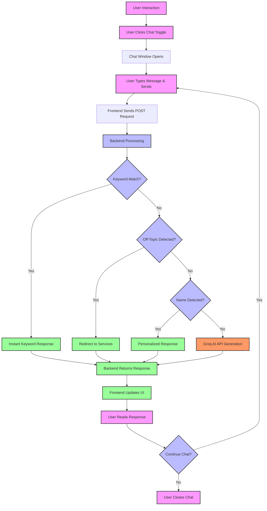
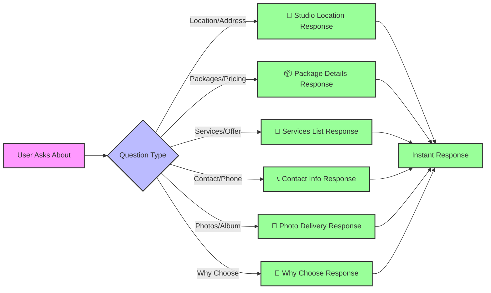

<div align="center">

# 📸 Fotographiya AI Chatbot
An intelligent AI-powered virtual assistant for Fotographiya - a premium wedding photography studio. This chatbot provides instant, context-aware responses about photography services, packages, pricing, and company information with a beautiful, responsive user interface.

[](https://nodejs.org/)
[](https://reactjs.org/)
[](https://expressjs.com/)
[](https://groq.com/)
[](LICENSE)
[]()

</div>

------------------------------------
## 📋 Table of Contents
* Overview
* Features
* Flow Diagram
* Tech Stack
* Project Structure
* Quick Start
* API Reference
* AI Response Logic
* Customization Guide
* Deployment
* Troubleshooting
* Performance Metrics
* Contributing
* Support

-----------------------------------------------
## 🎯 Overview
Fotographiya AI Chatbot is a full-stack conversational AI application designed to serve as a virtual assistant for Fotographiya's photography business. It intelligently answers customer queries about wedding photography services, packages, pricing, location, and more, reducing the load on human support staff while providing instant, accurate information 24/7.

### Key Capabilities
| Feature | Description |
|---------|-------------|
| **Toggle Button** | Floating chat toggle with live status indicator |
| **Branded Header** | Company logo, name, and online status display |
| **WhatsApp Integration** | Direct chat via WhatsApp with one click |
| **Call Integration** | One-tap phone call functionality |
| **Typing Indicator** | Real-time bot typing animation |
| **Responsive Design** | Optimized for desktop, tablet, and mobile devices |
| **Custom Fonts** | Inter font family for clean, professional typography |
----------------------
## ✨ Features
### 🤖 Intelligent Chat System
| Feature | Description | Status |
|---------|-------------|--------|
| Keyword Detection | Instant responses for services, pricing, location, contact | ✅ |
| AI Fallback | Groq LLM for complex, contextual queries | ✅ |
| Off-Topic Filtering | Politely redirects non-relevant questions | ✅ |
| Name Recognition | Personalized greetings and responses | ✅ |
| Session Management | In-memory conversation context | ✅ |

### 🎨 User Interface
| Feature | Description |
|---------|-------------|
| **Toggle Button** | Floating chat toggle with live status indicator |
| **Branded Header** | Company logo, name, and online status display |
| **WhatsApp Integration** | Direct chat via WhatsApp with one click |
| **Call Integration** | One-tap phone call functionality |
| **Typing Indicator** | Real-time bot typing animation |
| **Responsive Design** | Optimized for desktop, tablet, and mobile devices |
| **Custom Fonts** | Inter font family for clean, professional typography |

### 🏗️ Technical Features
| Feature | Description |
|---------|-------------|
| **Stateless Architecture** | No database required for minimal setup |
| **RESTful API** | Clean, documented endpoints |
| **CORS Enabled** | Secure cross-origin requests |
| **Environment Configuration** | Easy setup with .env files |
| **Hot Reload** | Fast development with nodemon & Vite |
| **Security Headers** | Helmet.js for enhanced protection |

----------------------------------
## 🔄 Flow Diagram
### Complete Chat Flow

### Keyword Response Flow




### System Architecture
```mermaid


flowchart TB
    subgraph Client["Client (Browser)"]
        React[React App]
        Components[Chat Components]
        Styles[CSS Styling]
    end
    
    subgraph Backend["Backend Server (Express)"]
        API[API Routes]
        AIService[AI Service Layer]
        CompanyData[Company Data]
    end
    
    subgraph External["External Services"]
        Groq[Groq API\nLlama 3.3 70B]
        WhatsApp[WhatsApp Integration]
        Phone[Phone Call]
    end
    
    React --> Components
    Components --> Styles
    Components -->|HTTP Request| API
    API --> AIService
    AIService --> CompanyData
    AIService -->|API Call| Groq
    Components -->|Click| WhatsApp
    Components -->|Click| Phone
    
    style Client fill:#e1f5fe,stroke:#333,stroke-width:2px
    style Backend fill:#f3e5f5,stroke:#333,stroke-width:2px
    style External fill:#e8f5e9,stroke:#333,stroke-width:2px


  ```
--------------------------------
## 🛠️ Tech Stack
### Frontend
| Technology | Version | Purpose |
|------------|---------|---------|
| **React** | 18.3.1 | UI Framework |
| **Vite** | 5.4.10 | Build Tool & Dev Server |
| **CSS3** | - | Styling with animations |
| **Inter Font** | - | Custom typography |
| **Oxlint** | 0.11.0 | Code linting |

### Backend
| Technology | Version | Purpose |
|------------|---------|---------|
| **Node.js** | ≥18.0.0 | Runtime Environment |
| **Express** | 4.22.2 | Web Framework |
| **Groq API** | - | LLM Integration (Llama 3.3 70B) |
| **Axios** | 1.18.1 | HTTP Client for API calls |
| **CORS** | 2.8.6 | Cross-Origin Resource Sharing |
| **Helmet** | 7.2.0 | Security Headers |
| **Morgan** | 1.11.0 | HTTP Request Logger |
| **dotenv** | 16.6.1 | Environment Configuration |

### APIs & Services

| Service | Purpose |
|---------|---------|
| **Groq Cloud** | AI Model Inference |
| **WhatsApp** | Direct messaging integration |
| **Telephony** | Click-to-call functionality |

-----------------------------
## 📁 Project Structure

```
Fotographiya-Chatbot/
│
├── Backend/
│   ├── .env                     
│   ├── .gitignore         
│   ├── package.json         
│   ├── package-lock.json          
│   ├── server.js      
│   │
│   └── src/
│       ├── app.js                   
│       ├── aiService.js         
│       ├── database.js           
│       ├── models.js              
│       │
│       └── data/
│           └── companyData.js     
│
├── Frontend/
│   ├── .env                    
│   ├── .gitignore                   
│   ├── .oxlintrc.json         
│   ├── index.html                  
│   ├── package.json             
│   ├── package-lock.json          
│   ├── README.md                 
│   ├── vite.config.js      
│   │
│   ├── public/
│   │   ├── favicon.svg           
│   │   └── icons.svg   
│   │
│   └── src/
│       ├── App.css      
│       ├── App.jsx           
│       ├── index.css  
│       ├── main.jsx   
│       │
│       ├── assets/
│       │   ├── font/
│       │   │   ├── Inter_18pt-Bold.ttf
│       │   │   ├── Inter_18pt-Medium.ttf
│       │   │   ├── Inter_18pt-Regular.ttf
│       │   │   └── Inter_18pt-SemiBold.ttf
│       │   └── logo/
│       │       └── logo.jpeg        
│       │
│       ├── components/
│       │   ├── ChatBot.jsx     
│       │   ├── ChatInput.jsx        
│       │   ├── ChatMessage.jsx      
│       │   ├── ChatMessages.jsx     
│       │   ├── ChatToggle.jsx       
│       │   ├── ChatWindow.jsx       
│       │   └── TypingIndicator.jsx
│       │
│       └── styles/
│           └── ChatBot.css          
│
└── README.md                      

```
----------------------------------
## 🚀 Quick Start

### Prerequisites
```
# Check Node.js version
node --version  # v18.0.0 or higher

# Check npm version
npm --version   # v9.0.0 or higher
```
>Note: You'll need a Groq API key. Sign up at console.groq.com to get your key.

### Step 1: Clone Repository
```base
git clone https://github.com/yourusername/fotographiya-chatbot.git
cd fotographiya-chatbot
```
### Step 2: Backend Setup

```
# Navigate to backend directory
cd Backend

# Install dependencies
npm install

# Create .env file
cat > .env << EOF
GROQ_API_KEY=your_groq_api_key_here
GROQ_API_URL=https://api.groq.com/openai/v1/chat/completions
AI_MODEL=llama-3.3-70b-versatile
PORT=5000
CLIENT_URL=http://localhost:5173
NODE_ENV=development
EOF

# Start backend server
npm run dev
```

#### Expected Output:
```
🚀 Server running on http://localhost:5000
📡 Environment: development
🤖 AI Model: llama-3.3-70b-versatile
💡 Chatbot is ready! No database required.
```
### Step 3: Frontend Setup

```
# Open new terminal, navigate to frontend
cd ../Frontend

# Install dependencies
npm install

# Create .env file
cat > .env << EOF
VITE_API_URL=http://localhost:5000/api
EOF

# Start frontend development server
npm run dev
```
#### Expected Output:
```
VITE v5.4.10  ready in 500 ms
➜  Local:   http://localhost:5173/
➜  Network: use --host to expose
```

### Step 4: Access Application
```
# Open browser and navigate to: http://localhost:5173
```
### Step 5: Test the Chatbot
Click the floating chat button in the bottom-right corner and test with these sample queries:

#### Sample Queries

| Query Type | Example Questions |
|------------|-------------------|
| **Services** | "What services do you offer?" |
| **Packages** | "What are your wedding packages?" |
| **Location** | "Where is your studio located?" |
| **Contact** | "How can I contact you?" |
| **Photographers** | "Tell me about your photographers" |
| **Pricing** | "How much does wedding photography cost?" |
| **Delivery** | "When will I get my photos?" |
| **Why Choose** | "Why should I choose Fotographiya?" |
-----------------------------------------
## 📡 API Reference
### Base URL
```
http://localhost:5000/api
```
### Endpoints
#### Health Check
```
GET /health
```
#### Response:
```
{
  "status": "success",
  "message": "Fotographiya ChatBot API is running",
  "timestamp": "2024-01-01T00:00:00.000Z",
  "uptime": 3600
}
```
#### Send Message
```
POST /chat/message
Content-Type: application/json
```
#### Request Body:
```
{
  "message": "What are your wedding packages?",
  "sessionId": "optional-uuid"
}
```
#### Success Response (200):
```
{
  "success": true,
  "data": {
    "message": "📦 Fotographiya Photography Packages...",
    "sessionId": "550e8400-e29b-41d4-a716-446655440000",
    "timestamp": "2024-01-01T00:00:00.000Z",
    "model": "llama-3.3-70b-versatile"
  }
}
```
#### Error Response (400):
```
{
  "success": false,
  "message": "Message is required"
}
```
#### Error Response (500):
```
{
  "success": false,
  "message": "Failed to process message"
}
```
-----------------------------------------------
## CURL Examples
``` base
# Health Check
curl http://localhost:5000/health

# Send Message
curl -X POST http://localhost:5000/api/chat/message \
  -H "Content-Type: application/json" \
  -d '{"message": "What photography services do you offer?"}'

# Test with Session ID
curl -X POST http://localhost:5000/api/chat/message \
  -H "Content-Type: application/json" \
  -d '{"message": "Tell me about wedding packages", "sessionId": "test-session-123"}'
  ```
---------------------------------------
## 🧠 AI Response Logic
### Priority Order
````mermaid

flowchart LR
    A[User Message] --> B[1. Keyword Matching]
    B -->|Fastest| C[Instant Response]
    A --> D[2. Off-Topic Detection]
    D -->|Filter| E[Redirect Response]
    A --> F[3. Name Detection]
    F -->|Personalize| G[Personalized Response]
    A --> H[4. AI Generation]
    H -->|Slowest| I[AI Response]
    
    style B fill:#f9f,stroke:#333,stroke-width:2px
    style H fill:#f96,stroke:#333,stroke-width:2px
    
````
| Category | Keywords | Response |
|----------|----------|----------|
| **Location** | location, address, where, studio, reach | 📍 Studio Location |
| **Packages** | package, packages, price, pricing, cost, rate | 📦 Package Details |
| **Services** | service, services, offer, offers | 📸 Services Overview |
| **Contact** | contact, phone, call, whatsapp, website, email | 📞 Contact Information |
| **Photos** | photos, album, gallery, portfolio, turnaround, delivery | 📸 Photo Delivery |
| **Why Choose** | why, choose, select, recommend, trust | 🌟 Why Fotographiya |
----
### Company Data Integration
All AI responses are grounded in the `companyData.js` file:
```javascript
{
  company: {
    name: 'Fotographiya',
    tagline: 'Preserving the special moments forever',
    location: 'Kota, Rajasthan',
    website: 'https://www.fotographiya.com',
    whatsapp: '918824127624',
    phone: '+918824127624',
    email: 'info@fotographiya.com'
  },
  services: {
    occasions: ['Wedding', 'Pre-wedding', 'Mehndi', 'Sangeet', ...],
    styles: ['Traditional', 'Candid', 'Cinematography', 'Drone', ...]
  },
  pricing: {
    packages: [
      { name: '1 Day Pre-Wedding', price: '₹35,000', ... },
      { name: '1 Day Wedding', price: '₹75,000 - ₹99,999', ... }
    ]
  }
}
```
-----------------------------------------
## 🎨 Customization Guide
###  1. Update Company Information
Edit Backend/src/data/companyData.js:

```javascript
company: {
  name: 'Your Studio Name',
  tagline: 'Your Tagline',
  location: 'Your City, State',
  website: 'https://yourwebsite.com',
  whatsapp: 'yourwhatsappnumber',
  phone: '+91XXXXXXXXXX',
  email: 'your@email.com'
}
```
### 2. Modify Services

```javascript
services: {
  occasions: [
    'Wedding & engagement',
    'Your Custom Service',
    // Add more services
  ],
  styles: [
    'Traditional photography',
    'Your Custom Style',
    // Add more styles
  ]
}
```
### 3. Update Pricing Packages

```javascript
pricing: {
  packages: [
    {
      name: 'Your Package Name',
      price: '₹XX,XXX',
      range: '₹XX,XXX - ₹XX,XXX',
      includes: 'What\'s included in the package'
    }
  ]
}
```
### 4. Customize Keyword Responses

```javascript
keywordResponses: {

  location: '📍 **Your Custom Location Response**\n\nAddress: Your Address\n\nCustom message...',
  package: '📦 **Your Custom Package Response**\n\nYour package details...'

}
```
### 5. Change AI Model
Edit `Backend/.env`:

```env

AI_MODEL=mixtral-8x7b-32768

# Available options:
# - llama-3.3-70b-versatile (Default)
# - mixtral-8x7b-32768
# - gemma2-9b-it

```
### 6. Modify System Prompt
Edit `Backend/src/aiService.js`:
```javascript
getSystemPrompt() {

  return `Your custom system prompt here...`;

}
```
### 7. Customize UI Theme
Edit `Frontend/src/styles/ChatBot.css`:
```css
/* Change primary color */
.chat-header {
  background: #000000; /* Change to your brand color */
}

/* Change button colors */
.chat-toggle-btn {
  background: #000000; /* Change to your brand color */
}
```
### 8. Add New Features
Example: Add appointment booking:
```javascript
// In companyData.js

keywordResponses: {

  booking: "📅 **Book Your Session**\n\nTo book a photography session:\n1. Visit our website\n2. Call us at +918824127624\n3. Or message us on WhatsApp"

}
```
### 9. Environment Variables
#### Backend Variables
| Variable | Required | Default | Description |
|----------|----------|---------|-------------|
| `GROQ_API_KEY` | ✅ | - | Your Groq API key |
| `GROQ_API_URL` | ❌ | `https://api.groq.com/openai/v1/chat/completions` | Groq API endpoint |
| `AI_MODEL` | ❌ | `llama-3.3-70b-versatile` | AI model to use |
| `PORT` | ❌ | `5000` | Server port |
| `CLIENT_URL` | ❌ | `http://localhost:5173` | Frontend URL for CORS |
| `NODE_ENV` | ❌ | `development` | Environment mode |
---
#### Frontend Variables
| Variable | Required | Default | Description |
|----------|----------|---------|-------------|
| `VITE_API_URL` | ✅ | `http://localhost:5000/api` | Backend API URL |
-------------------------------------
## 🚢 Deployment
### Development Mode (Local)
The project is designed to run locally for internal company use. Follow these steps to set up the development environment:

#### Prerequisites
```base

# Check Node.js version
node --version  # v18.0.0 or higher

# Check npm version
npm --version   # v9.0.0 or higher

```
>Note: You'll need a Groq API key. Sign up at console.groq.com to get your key.

### Step 1: Clone Repository
```
git clone https://github.com/yourusername/fotographiya-chatbot.git
cd fotographiya-chatbot
```
#### Expected Output:
```text
VITE v5.4.10  ready in 500 ms
➜  Local:   http://localhost:5173/
➜  Network: use --host to expose
```
### Step 2: Access Application
```
# Open browser and navigate to:
http://localhost:5173
```
---------------------------------------------
## 🔧 Troubleshooting
### Common Issues & Solutions
##### Error:
``` 
Error: Cannot find module 'dotenv'
```
##### Solution:

```
cd Backend
npm install dotenv
```

##### Error:
```
Error: Cannot find module 'dotenv'
```
##### Solution:

```
cd Backend
npm install dotenv
```
#### 2. CORS Errors
#####  Error:
```
Access to fetch at 'http://localhost:5000' from origin 'http://localhost:5173' has been blocked by CORS policy
```
##### Solution: Check `Backend/.env`:
```env

CLIENT_URL=http://localhost:5173

```
#### 3. Groq API Key Invalid
##### Error:

```
Error: Invalid API key
```
##### Solution:
* Verify your Groq API key in Backend/.env

* Get a new key from console.groq.com

#### 4. Port Already in Use
##### Error:
```
Error: listen EADDRINUSE: address already in use :::5000
```
##### Solution:
**For Windows:**
```
# Find process using port 5000
netstat -ano | findstr :5000

# Kill process (replace PID with actual process ID)
taskkill /PID <PID> /F

# Or use a different port
set PORT=5001 && npm run dev
```
**For Mac/Linux:**
```
# Kill process on port 5000
lsof -ti:5000 | xargs kill -9

# Or use a different port
PORT=5001 npm run dev
```
### Debug Mode
Enable debug logging:
```
# Backend
NODE_ENV=development npm run dev
```
---------------------------------------------------------
## 📊 Performance Metrics

| Metric | Value | Description |
|--------|-------|-------------|
| ⚡ **Response Time (Keyword)** | < 100ms | Instant keyword-based responses |
| 🤖 **Response Time (AI)** | 1-3s | AI-generated responses |
| 💾 **Memory Usage** | ~200MB | Average memory consumption |
-----------
---
## 📄 License

**Copyright © 2024 Fotographiya. All rights reserved.**

This project was developed during an internship at Fotographiya and is the exclusive property of the company. It is intended for internal use only to support the company's business operations.

**Terms:**
- ❌ No unauthorized copying or distribution
- ❌ No commercial use outside Fotographiya
- ❌ No modification without permission
- ✅ Internal use within Fotographiya only

> **⚠️ Important:** This is proprietary software developed for Fotographiya. Please contact the company for any usage permissions.

---

**Intern Developer:** Harshita Rathore  
**Company:** Fotographiya  
**Purpose:** Internal Chatbot System  
**Year:** 2026

----------------------------
## 🙏 Acknowledgments

- **Fotographiya** - For providing the opportunity to work on this project during internship
- **Groq Inc.** - For providing powerful LLM APIs
- **React Team** - For the amazing UI library
- **Vite Team** - For the fast build tool
- **Express Team** - For the robust web framework
- **Inter Font** - For the beautiful typography

------------------------
## 🤝 Contributing

This project is for internal company use only. However, if you're part of the Fotographiya team and want to contribute:

1. Fork the repository
2. Create a feature branch
3. Make your changes
4. Test thoroughly
5. Submit a pull request for review

Please ensure all code follows the existing style and includes appropriate comments.

-----------------------------------

<div align="center">
  <sub>
  Developed with ❤️ during internship at Fotographiya <br>
  Built with 🚀 by Harshita Rathore | Fotographiya Intern 2026
  </sub>
</div>


