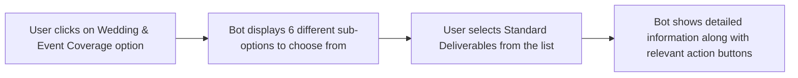
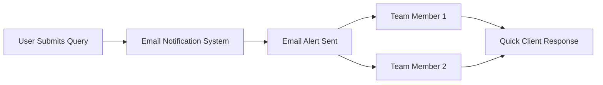

# 📸 Fotographiya Wedding Photography Chatbot

A fully functional, options-based chatbot built for **Fotographiya** — a premium wedding photography and cinematography brand. The chatbot follows a *Flipkart-style* structured conversation flow with hierarchical menus, options-based navigation, and detailed informational endpoints.

> [!NOTE]
> The chatbot operates **without any external AI API** (like ChatGPT or Groq). All responses are pre-defined and stored in a clean JSON configuration file, making it lightning-fast, 100% reliable, and incredibly easy to maintain.

---

## 📌 Table of Contents
* [Overview](#-overview)
* [Features](#-features)
* [Tech Stack](#-tech-stack)
* [Project Structure](#-project-structure)
* [Installation & Setup](#-installation--setup)
* [How to Use](#-how-to-use)
* [How to Edit Content](#-how-to-edit-content)
* [API Endpoints](#-api-endpoints)
* [Request Tracking](#-request-tracking)
* [Pending Tasks](#-pending-tasks)
* [License](#-license)

---

## 🔍 Overview
This chatbot is designed to assist Fotographiya's clients with instant information about wedding photography services, pricing packages, team details, and consultation bookings. It works like a guided conversation where users click on intuitive options to navigate through menus and get detailed answers without typing anything.

---

## ✨ Features

### ⚙️ Core Features
* **Flipkart-Style Options Navigation** — Users click on buttons instead of typing long queries.
* **Three-Level Conversation Flow** — Smooth transition: `Main Menu` ➔ `Sub-menu` ➔ `Detailed Answers`.
* **Universal Reset** — A *"Return to Main Menu"* button is available on every single screen.
* **Premium UI** — A clean, black-and-white minimalist design matching the brand's aesthetic.
* **100% Responsive** — Works flawlessly on mobile, tablet, and desktop screens.
* **Typing Indicator** — Smooth animation that shows when the bot is "thinking" or responding.

### 📂 Content Sections Integrated
* **Wedding & Event Coverage** — Deliverables, team size, high-end equipment info, overtime policy, and direct portfolio links.
* **Investment & Packages** — Structured pricing for pre-wedding, wedding day, destination gigs, and bespoke setups.
* **Schedule a Consultation** — One-click hooks for WhatsApp routing, office visits, availability check, or callback requests.

---

## 🛠️ Tech Stack

| Layer | Technology |
| :--- | :--- |
| **Frontend** | React 19 + Vite |
| **Styling** | Vanilla CSS3 + Google Fonts (Inter) |
| **Backend** | Node.js + Express |
| **Data Layer** | Static JSON Configuration File |
| **Security** | Helmet, CORS, & Rate Limiting |
| **Icons** | None (Clean, text-based button UI) |

---

## 📂 Project Structure

```text
fotographiya-chatbot/
│
├── Backend/
│   ├── server.js                        
│   ├── package.json                       
│   ├── .env                            
│   └── src/
│       ├── data/
│       │   └── chatbot-config.json        
│       ├── controllers/
│       │   └── chatController.js         
│       ├── routes/
│       │   └── chatRoutes.js             
│       └── middleware/
│           └── errorHandler.js            
│
└── Frontend/
    ├── index.html
    ├── vite.config.js
    ├── package.json
    └── src/
        ├── main.jsx
        ├── App.jsx
        ├── components/
        │   ├── Chatbot.jsx                
        │   ├── ChatWindow.jsx             
        │   ├── ChatHeader.jsx             
        │   ├── ChatMessages.jsx          
        │   ├── ChatMessage.jsx           
        │   ├── ChatToggle.jsx             
        │   └── OptionGrid.jsx             
        └── style/
            └── chatBotStyle.css

```

# 📸 Fotographiya Chatbot

An interactive chatbot widget for Fotographiya's photography services, built with React and Node.js.

---

## 📋 Table of Contents
- [Installation & Setup](#-installation--setup)
- [How to Use](#-how-to-use)
- [How to Edit Content](#-how-to-edit-content)
- [API Endpoints](#-api-endpoints)
- [Request Tracking](#-request-tracking)
- [Pending Tasks](#-pending-tasks)
- [License](#-license)
- [Acknowledgements](#-acknowledgements)

---

## 🚀 Installation & Setup

### 📋 Prerequisites
| Requirement | Version |
|-------------|---------|
| Node.js | v18 or higher |
| npm | v9 or higher |

---

### Step 1: Clone the Repository
```bash
git clone <repository-url>
cd fotographiya-chatbot

```
### Step 2: Backend Setup
```cd Backend
npm install
npm run dev

```
✅ The backend server will start on: http://localhost:5000


### Step 3: Frontend Setup
Open a new terminal window or tab, then run:

```cd Frontend
npm install
npm run dev

```
✅ The frontend development server will spin up on: http://localhost:5173


### Step 4: Open in Browser
1. Launch your browser and head to http://localhost:5173
2. Look at the bottom-right corner — click the custom toggle launcher to slide open the chatbot window! 🎯
## 🎮 How to Use

### For Users

| Step | Action |
|:----:|--------|
| 1️⃣ | Click the chat toggle launcher located at the bottom-right corner of the screen |
| 2️⃣ | The interactive chat window will smoothly slide into view with a beautiful animation |
| 3️⃣ | Simply click on any option button that best matches your query or interest |
| 4️⃣ | Read the detailed information provided, or hit **"Return to Main Menu"** to start a fresh conversation |

## 🔄 Example Flow



## 🔄 Example Interaction Flow

| User Action | Bot Response |
|-------------|--------------|
| Clicks on **Wedding & Event Coverage** | Bot generates and displays 6 distinct sub-options for the user to explore |
| Selects **Standard Deliverables** | Bot provides comprehensive details along with relevant action buttons for next steps |

---

## 📝 How to Edit Content

> [!IMPORTANT]
> The entire conversation structure is stored in a **single JSON file**. You can update menus, text content, and button options without modifying any JavaScript or React code!

### 📍 File Location
Backend/src/data/chatbot-config.json


---

## ➕ Adding a New Option

### 1️⃣ Step 1: Add your new option to the target menu
Inside the options array of your desired menu, append the new option:

```json
"menu": {
  "options": [
    { "id": "existing", "label": "Existing Option" },
    { "id": "new_option", "label": "New Option" }
  ]
}

```
### 2️⃣ Step 2: Define the actual payload/response block for that exact ID lower down in the file

```"new_option": {
  "type": "details",
  "title": "Your Custom Title Here",
  "message": "Your highly customized, beautifully written response goes here...",
  "options": [
    { "id": "book", "label": "Book Now" },
    { "id": "menu", "label": "Return to Main Menu" }
  ]
}

```
> [!TIP]
> **Quick Tip:** After making changes to `chatbot-config.json`, restart your backend server by pressing `Ctrl + C` in the terminal, then run `npm run dev` to reload the updated configuration. Finally, refresh your browser window to see the new changes in action!

---

## 🔗 API Endpoints

| Method | Endpoint | Description |
|:------:|----------|-------------|
| `POST` | `/api/chat/message` | Sends the user's selected option and retrieves the corresponding menu response from the server |
| `GET` | `/api/chat/health` | Checks if the chat route controller is working properly and responding as expected |
| `GET` | `/health` | Performs a basic health check to verify that the core server is running without any issues |

### 📥 Request Format

```{
  "message": "wedding_coverage",
  "conversationId": "optional-session-uuid"
}
```

### 📤 Response Format
```
{
  "success": true,
  "type": "menu",
  "message": "Content string payload",
  "options": [
    { "id": "option_id", "label": "Display Label" }
  ],
  "title": "Optional Screen Title",
  "conversationId": "session-uuid",
  "timestamp": "2026-06-24T08:15:00.000Z"
}
```

## Request Tracking
**Current Status**
> **INFO**: Right now, user interactions and button clicks pipe straight into the backend terminal logs. While fine for local staging, this needs production scaling.

## Recommended Logging Setup
To capture lead queries silently in production, you can drop this quick file-stream logger directly into server.js:
```
javascript
const fs = require('fs');

app.use((req, res, next) => {
  const log = `[${new Date().toISOString()}] IP: ${req.ip} - Target Node: ${req.body.message || 'initial_connection'}\n`;
  fs.appendFileSync('logs/requests.log', log);
  next();
});

```

## ⏳ Pending Tasks

Before deploying this chatbot on the live Fotographiya website, the following tasks need to be completed:

| # | Task Description | Current Status | Priority Level |
|:---:|-------------------|:---:|:---:|
| 1 | Integrate official brand design assets including the Fotographiya logo, color scheme, and typography | ⏳ Pending | 🔴 High |
| 2 | Update placeholder pricing information with actual photography package rates and studio offerings | ⏳ Pending | 🔴 High |
| 3 | Set up a file-based logging system to capture all user interactions for production monitoring | ⏳ Pending | 🔴 High |
| 4 | Configure instant webhook notifications to send real-time alerts via Telegram and Email | ⏳ Pending | 🟡 Medium |
| 5 | Build an internal admin dashboard to monitor user traffic and chatbot performance analytics | ⏳ Pending | 🟡 Medium |

---

## 📋 Detailed Task Breakdown

<details>
<summary><b>🔴 Click to expand: High Priority Tasks</b></summary>

### Task 1: Brand Design Assets
- Integrate the official Fotographiya logo into the chatbot interface
- Apply the brand's approved color palette throughout the widget
- Ensure consistent typography and font styling across all components

### Task 2: Pricing Packages
- Update wedding photography package pricing with current rates
- Add corporate event photography pricing options
- Include portrait session packages with accurate pricing details

### Task 3: Production Logging Framework
- Set up automated log rotation to manage file sizes
- Implement comprehensive error tracking for debugging
- Add performance monitoring to track response times and uptime

</details>

<details>
<summary><b>🟡 Click to expand: Medium Priority Tasks</b></summary>

### Task 4: Webhook Notifications
- Configure the Telegram bot for instant message alerts
- Set up email notification system for lead capture
- Test notification delivery to ensure proper functionality

### Task 5: Internal Dashboard
- Design an intuitive admin interface for monitoring
- Implement analytics to track user interactions and patterns
- Add session tracking to monitor user behavior in real-time

</details>
## ✅ Implemented Features

### 📬 Email Notification System

> **Status:** ✅ Implemented & Functional

The chatbot now includes a **real-time email notification system** that instantly sends user queries and lead information to the team via email. This ensures that no client inquiry is missed, even when the team is not actively monitoring the chatbot dashboard.

---

#### 🔔 How It Works

| Step | Process |
|:----:|---------|
| 1️⃣ | User interacts with the chatbot and selects an option or submits a query |
| 2️⃣ | The chatbot captures the user's selection, along with session details |
| 3️⃣ | The system automatically triggers an email notification to the configured email address |
| 4️⃣ | Team members receive detailed email alerts with complete user interaction data |
| 5️⃣ | Team can follow up with the client promptly without any delay |

---

#### 📧 Email Notifications

- **Detailed Reports** — Each email contains comprehensive user interaction details including timestamp, selected options, and session ID
- **Lead Capture** — Automatically captures potential client information for future follow-ups
- **Team Distribution** — Notifications can be sent to multiple team members simultaneously

---

#### 📊 Notification Flow


### ✅ Key Benefits

| Benefit | Description |
|---------|-------------|
| **Instant Email Alerts** | Team members receive immediate email notifications as soon as a user interacts with the chatbot, ensuring timely awareness |
| **Complete Query Capture** | Every user interaction is automatically recorded and forwarded via email, so no client inquiry is ever missed or overlooked |
| **Faster Response Time** | Enables the team to respond to client queries promptly, leading to better customer experience and satisfaction |
| **Automatic Lead Tracking** | All potential client inquiries are automatically logged for future follow-up, making lead management easier and more organized |
| **Team-Wide Coverage** | Notifications can be sent to multiple team members at once, ensuring better collaboration and faster resolution of client queries |

### Configuration
#### Environment Variables to Configure:
Create a .env file in the Backend folder and add the following configuration:
```
# Email Configuration
EMAIL_USER=your-email@gmail.com
EMAIL_PASS=your-app-password
NOTIFICATION_EMAIL=team@fotographiya.com

```
> Note: This feature helps the Fotographiya team stay informed about every client interaction. All user queries are captured and instantly sent via email, allowing the team to respond quickly and provide efficient client support.

| Variable | Description |
|----------|-------------|
| `EMAIL_USER` | Email account used to send chatbot notifications. |
| `EMAIL_PASS` | Authentication password for the sender email account. |
| `NOTIFICATION_EMAIL` | Recipient email address for chatbot messages and alerts. |

## License
> © 2026 Fotographiya. All rights reserved.
> This project is proprietary and confidential. All structural layouts, logic flows, and source files are protected. Unauthorized copying, distribution, or use of this software is strictly prohibited.

## 🙌 Acknowledgements

We would like to express our sincere gratitude to the following:

- **React & Vite Ecosystem** ⚡ – For providing an incredible development environment that made building this interactive chatbot smooth and efficient
- **Google Fonts** 🔤 – For offering the elegant and modern Inter font family that enhances the visual appeal of our chatbot interface
- **Open-Source Community** 🌟 – For creating and maintaining countless invaluable tools, libraries, and resources that powered this project

---

## 🏷️ Keywords

`chatbot` • `photography` • `react` • `nodejs` • `vite` • `interactive-widget` • `fotographiya` • `wedding` • `events` • `customer-service`

---

## 📞 Support & Contact

For any questions, issues, or feedback regarding this project, please feel free to reach out:

📧 **Email:** [harshitar713@gmail.com]  
🔗 **GitHub:** [https://github.com/harshita713lab]  

> 📌 **Note:** This project was developed as part of an internship assignment. For any official inquiries related to the company, please contact the organization directly through their official channels.

---

## 👩‍💻 Developer

**Name:** [Harshita Rathore]  
**Role:** Intern Developer  
**Organization:** Fotographiya  
**GitHub:** [harshita713lab]

---

## 📝 Project Status

This project is actively maintained and was developed to enhance customer interaction for Fotographiya's photography services. Future updates and improvements will be added as per requirements.

---

## 🤝 Contributing

This is a proprietary project developed for Fotographiya. However, suggestions and feedback are always welcome! Feel free to open an issue or reach out via email.

---

<div align="center">

---

### 🚀 Thank You for Visiting!

*This project was created with dedication and passion during an internship at Fotographiya.*

---

**Developed with ❤️ by [Harshita Rathore]**

---

[⬆ Back to Top](#-fotographiya-chatbot)

</div>
---
